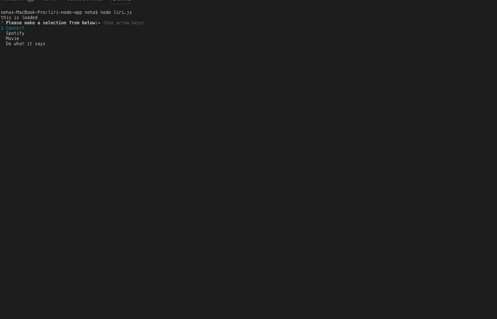
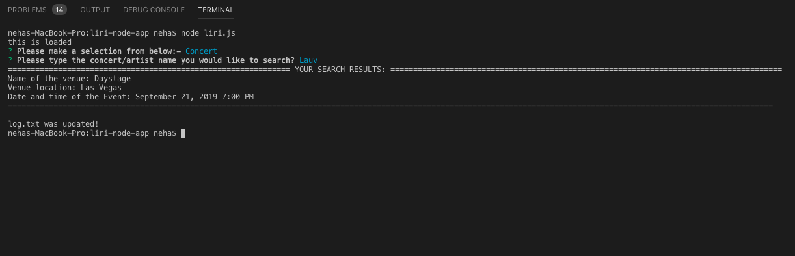
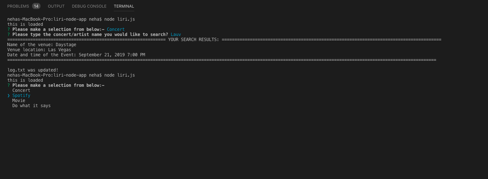
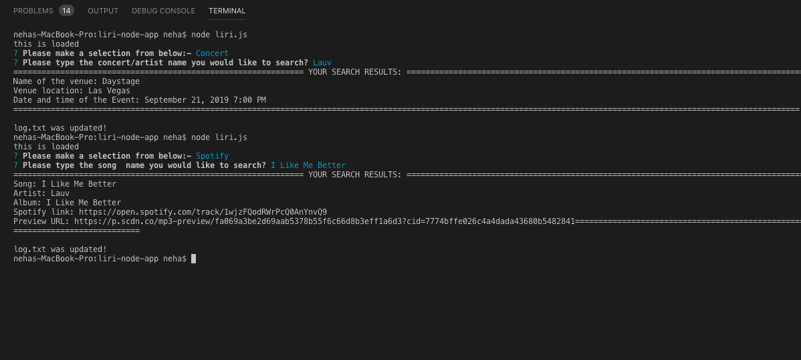
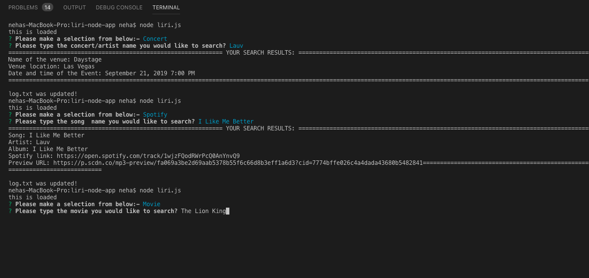
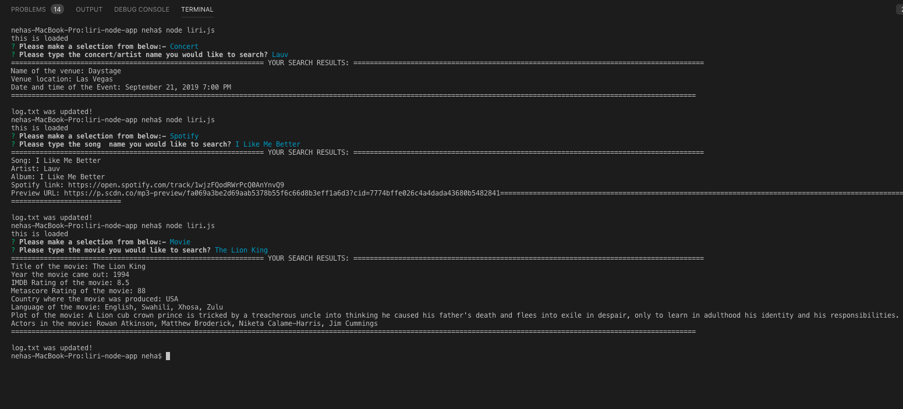
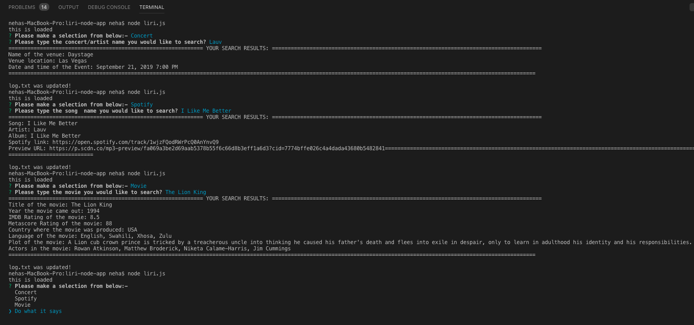
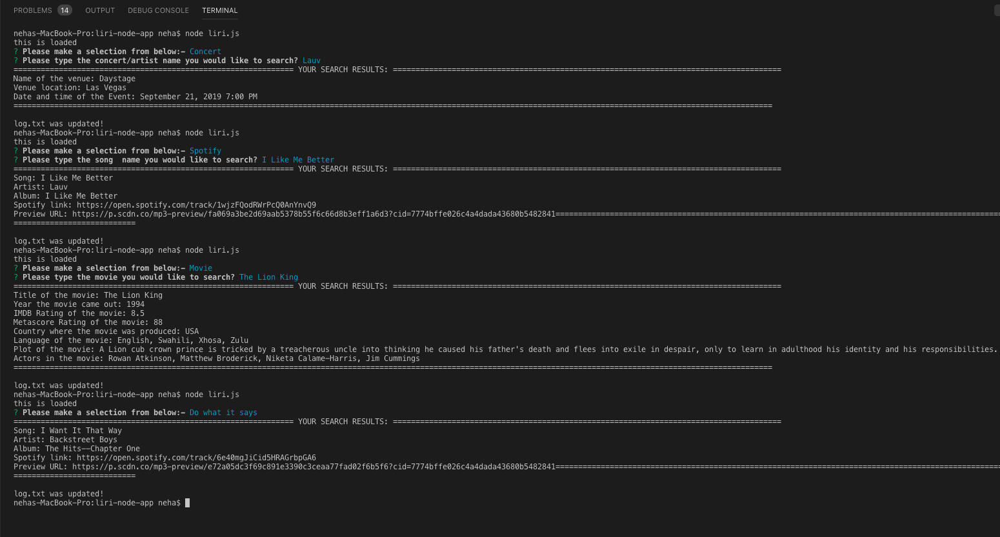
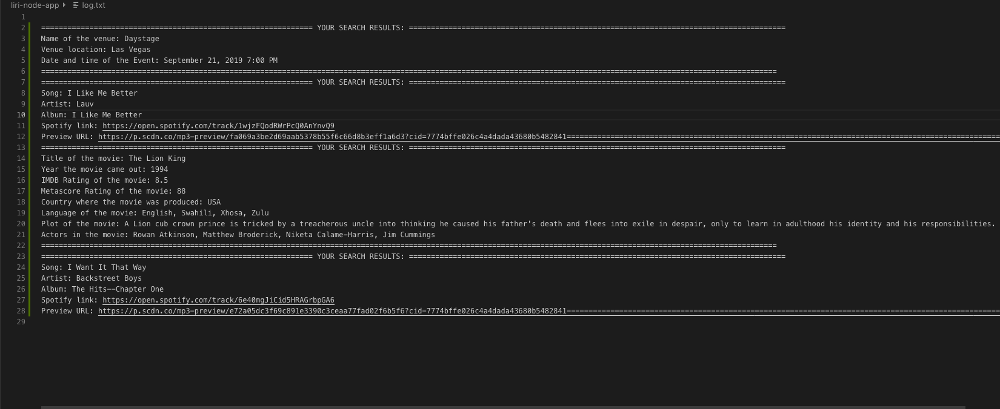

# liri-node-app
 LIRI is a _Language_ Interpretation and Recognition Interface. LIRI will be a command line node app that takes in parameters and gives you back data.
To install these npm packages, cd into the folder, then run
npm install 

#Technologies Used
1. Node.js
2. JavaScript
3. Bands in Town API (via twitter npm module)
4. Spotify API (via spotify npm module)
5. OMDb API (via request npm module)

#Code Explanation
1. Authentication keys for spotify are stored in "keys.js", and we are exporting its contents to the main "liri.js" file
2. What this app does depends on what the user selects from the drop down, and there are 4 main functions: 
    * prints latest concert details 
    * Spotify lookup for a song, 
    * OMDb lookup for a movie, and 
    * read command and query from another file
The program makes a request to the Bands in town API that is limited by parameters,and selectively output using console.log
The program also makes a request to the Spotify API, and we get back a JSON object that includes everything we need (artist(s), song, preview link, and album)
The program also makes a HTTP request to the OMDb API using the request NPM module, and we get back a JSON object that includes everything we need (title, year, IMDb rating, language, etc.)
The program also reads from a file called "random.text" and executes the command and query found there using string and array methods
Appropriate comments and error-checking has been added and all the search results are logged into a log.txt file as well.

#Instructions
1. In order to clone this app and run, you would need to supply .env file for it to work.

2. Type command "node liri.js" in terminal which will result into the below display:-

3. Use arrow keys(up or down) to make appropriate selection. If "concert" is selected. You would be prompted to enter the <artist/band name> here.
 This will search the Bands in Town Artist Events API ("https://rest.bandsintown.com/artists/" + artist + "/events?app_id=codingbootcamp") for an artist and render the following information about each event to the terminal:
Name of the venue
Venue location
Date of the Event (use moment to format this as "MM/DD/YYYY")
If no info is provided then the program will default to "Shawn Mendes".

4. If you select the spotify option

you would be again prompted to enter the <song name here>
This will show the following information about the song in your terminal/bash window
Artist(s)
The song's name
A preview link of the song from Spotify
The album that the song is from
If no song is provided then the program will default to "Old Town Road" by Lil Nas X.

5. If you select the  Movie option
Please input the <movie name here>

This will output the following information to your terminal/bash window:

If the user doesn't type a movie in, the program will output data for the movie 'Forrest Gump.'

6. If you select do-what-it-says

Using the fs Node package, LIRI will take the text inside of random.txt and then use it to call one of LIRI's commands.
It will run spotify for "I Want it That Way," as follows the text in random.txt.

7. And all the search results will be updated in the log.txt file.

